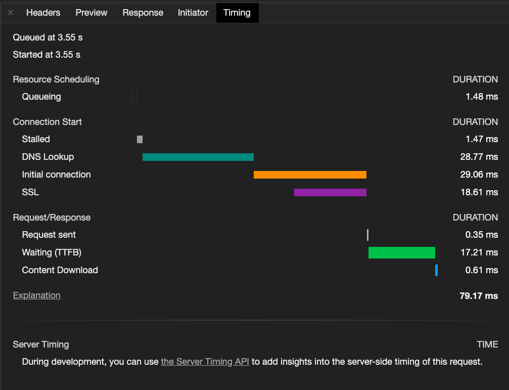
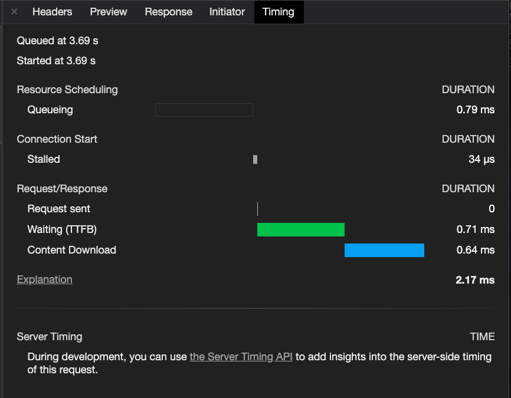
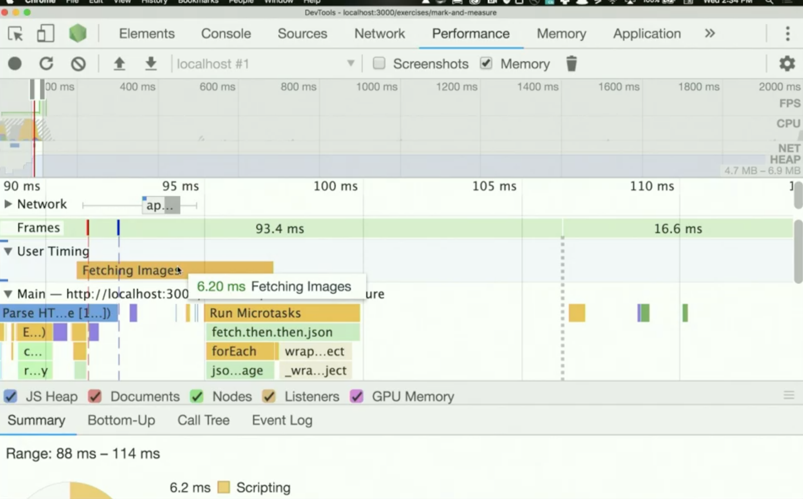
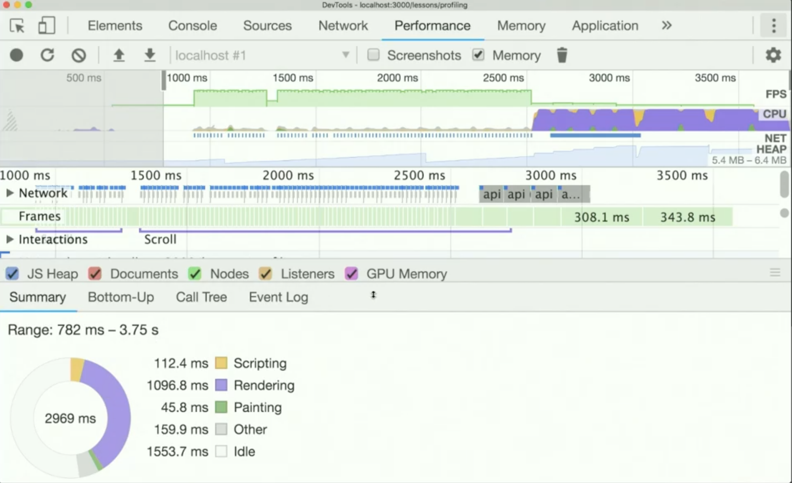
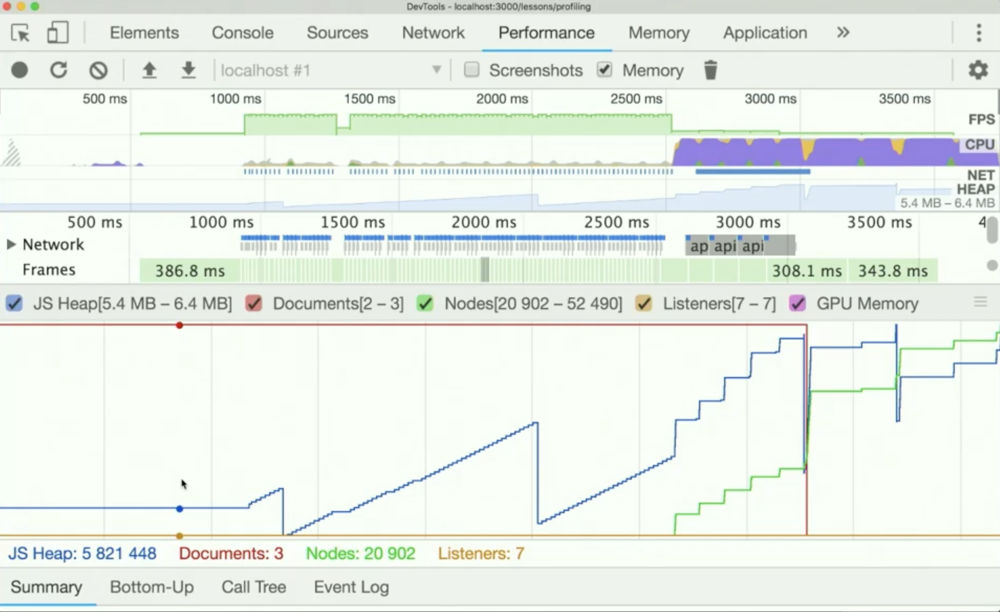
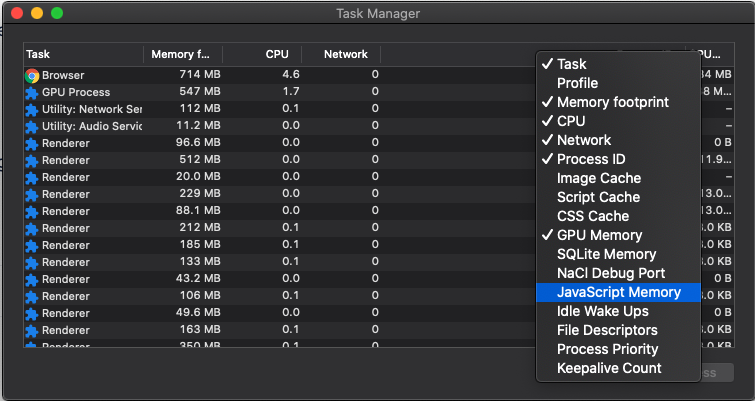
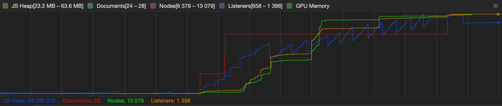
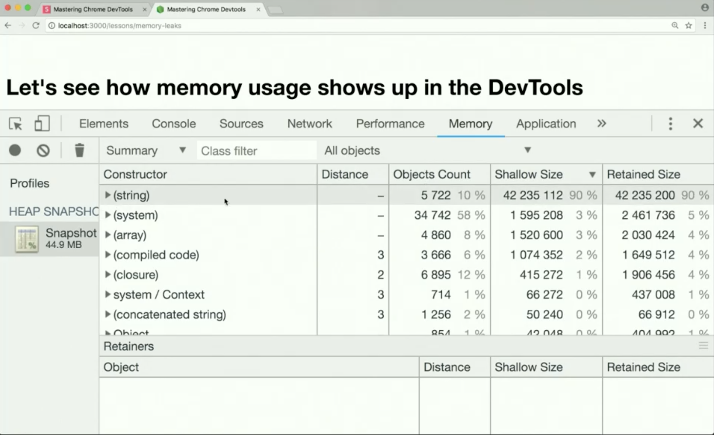

# Mastering Chrome DevTools

[Official Documentation](https://developers.google.com/web/tools/chrome-devtools/)

[Mastering Chrome Devtools](https://github.com/jkup/mastering-chrome-devtools) | [Slides](https://slides.com/jkup/devtools/#/6) | [Jon Kuperman](https://github.com/jkup/ama)

# History of Debugging

A reviews a brief history of browser developer tools. Years ago developers relied on viewing the page source, alert boxes and plugins like Firebug. Today each browser has its own set of developer tools enabling a much richer debugging experience.

[Viewsource](https://css-tricks.com/view-source/)

[Live DOM Viewer](http://software.hixie.ch/utilities/js/live-dom-viewer/)

[Firebug 0.3](http://v0.joehewitt.com/blog/firebug_03_done.php)

## Use the DevTools as an IDE

You can use Chrome DevTools as a full time IDE. It can do a bunch of amazing things, such as:

- Edit HTML and CSS
- Save and reuse your color palette (Multiple options: by redefining color scheme with OS'color wheel UI, Google's Material Design clolr scheme or DevTools can generate the site's own color scheme)
- Scroll items into view (right click on the HTML element)
- Hide and show elements (click the 'H' key to toggle the visibility of a HTML element)
- Trigger various states (:hover, :focus, etc)
- Display computed styles (CSS tab)
- Find event listeners
- Change color formats from hexadecimal to RGB, etc (click the 'shift' key on the square of the css color)
- Drag and drop DOM nodes
- Visualize CSS specificity ([CSS SpeciFISHity](https://specifishity.com/))
- Pretty print source code (Source tab)
- Break on DOM changes
- Save changes to disk ([Edit Files With Workspaces](https://developers.google.com/web/tools/chrome-devtools/workspaces/))
- Use special symbols in the console (Recent Selection History | $0 or $1)

## Debug complex applications

DevTools provides us with a powerful step through debugger located under the Source panel.

- Step through a JavaScript file (Watch, Call Stack, Scope and Breakpoints)
- Add breakpoints
- Watch variables
- Blackbox scripts (Inside Call Stack, click right on the js file you want to blackbox)
- Add conditional breakpoints (right click on the line number you want to debbug and add conditional breakpoint)
- Add XHR breakpoint ()

## Analyze network traffic

The Network panel displays a lot of information about how the page loaded including a filterable waterfall diagram that shows when and how long each asset took to load. Detailed information about each asset including status code, size, type, and an initiatoris listed at the bottom.

The Requests table displays the following columns by default:

- Name: The filename of, or an identifier for, the resource.
- [Status](https://http.cat/): The HTTP status code.
- Type: The MIME type of the requested resource.
- [Initiator](https://developers.google.com/web/tools/chrome-devtools/network/reference#initiators-dependencies): The following objects or processes can initiate requests:
  - Parser: Chrome's HTML parser.
  - Redirect: An HTTP redirect.
  - Script: A JavaScript function.
  - Other: Some other process or action, such as navigating to a page via a link or entering a URL in the address bar.
- Size: The combined size of the response headers plus the response body, as delivered by the server.
- Time: The total duration, from the start of the request to the receipt of the final byte in the response.
- [Waterfall](https://developers.google.com/web/tools/chrome-devtools/network/reference#waterfall): A visual breakdown of each request's activity.

        Tip: hold the SHIFT key and hover over the request in the Requests table to view the initiators and dependencies of a request. DevTools colors initiators green, and dependencies red.

Let's now reviews the meanings behind the color codes that are displayed in a Chrome DevTools waterfall diagram:

### Examples





### Queuing (white)

A request being queued indicates that:

- The request was postponed by the rendering engine because it's considered lower priority than critical resources (such as scripts/styles). This often happens with images.
- The request was put on hold to wait for an unavailable TCP socket that's about to free up.
- The request was put on hold because the browser only allows [six TCP connections](https://bugs.chromium.org/p/chromium/issues/detail?id=12066) per origin on HTTP 1.
- Time spent making disk cache entries (typically very quick.)

### Stalled / Blocking (grey)

Time the request spent waiting before it could be sent. It can be waiting for any of the reasons described for Queueing. Additionally, this time is inclusive of any time spent in proxy negotiation.

### Proxy Negotiation (grey)

Time spent negotiating with a proxy server connection.

### DNS Lookup (light green)

Time spent performing the DNS lookup. Every new domain on a page requires a full roundtrip to do the DNS lookup.

### Initial Connection / Connecting (orange)

Time it took to establish a connection, including TCP handshakes/retries and negotiating a SSL.

### SSL (dark orange)

Time spent completing a SSL handshake.

### Request Sent / Sending (gren)

Time spent issuing the network request. Typically a fraction of a millisecond.

### Waiting (TTFB) (green)

Time spent waiting for the initial response, also known as the Time To First Byte. This time captures the latency of a round trip to the server in addition to the time spent waiting for the server to deliver the response.

### Content Download / Downloading (dark blue)

Time spent receiving the response data.

### Capture Screenshoots

[Screenshots](https://developers.google.com/web/tools/chrome-devtools/network#screenshots) let you see how a page looked over time while it was loading. PS: screenshots are now on the Performance tab .

## Audit a website

Performance of a webpage can translate to a loss in traffic or even a decline in sales. Some examples:

    Google.com: +500 ms (speed decrease) -> -20% traffic loss

    Yahoo.com: +400 ms (speed decrease) -> -5-9% full-page traffic loss (visitor left before the page finished loading)

    Amazon.com: +100 ms (speed decrease) -> -1% sales loss

There are many auditing tools that look at a site's performance and interactivity. Here is some examples:

- [Webpagetest](https://www.webpagetest.org/) (free/public domain)

- [Lighthouse](https://developers.google.com/web/tools/lighthouse/) was a very detailed [progressive web apps checklist](https://developers.google.com/web/progressive-web-apps/checklist)

- [Sonarwhal by Microsoft](https://sonarwhal.com/)

### Data streams compression

We all know and love Gzip as a compression algorithm, but today there are some new player in town — Brotli and Zopfli.

[Brotli](https://github.com/google/brotli) is a generic-purpose lossless compression algorithm that compresses data using a combination of a modern variant of the LZ77 algorithm, Huffman coding and 2nd order context modeling. It is developed by Google, it uses a dictionary of common keywords and phrases on the client side and the server side, and it gives a better compression ratio.

[Zopfli](https://github.com/google/zopfli) Compression Algorithm is a compression library programmed in C to perform very good, but slow, deflate or zlib compression.

## Analyze Node.js performance

Node is now natively established and integrates very seamless with the Chrome DevTools. [Debugging Node.js](https://nodejs.org/en/docs/guides/debugging-getting-started/) applications by running an app with the `--inspect` flag.

> `node --inspect server/index.js`

By running the command above, when you open the Chrome DevTools you will see a Node icon on the top left corner. By clicking on it, you will open a dedicated dev tools for Node. You will see that this will give you a bunch of cool thing you can verify like Memory, Source maps for transpiled code, etc. We can make sure our connection is still working and, in the Profiler tab, you can sampling JavaScript profiler w/ [flamechart](./flamecharts.md).

To see how your Node app is working, you can Start a profile, go to your page, just refresh it, go back to the profile and hit Stop. This will generate a [flamechart](./flamecharts.md) (the x-axis is time and the y-axis is the call stack) to show you what the actual back-end application is doing. Remember, this isn't looking at your front end assets anymore.

Tutorial: [Debugging and profiling Node.js applications](https://developer.ibm.com/technologies/node-js/tutorials/learn-nodejs-debugging-and-profiling-node-applications/)

## Performance Monitoring

There are two schools of monitoring Controlled and User Monitoring.

The old approach of measuring performance.

```js
const start = new Date().getTime();
// Do some work
const end = new Date().getTime();
const time = end - start;
```

Now we can use the [Performance API](https://developer.mozilla.org/en-US/docs/Web/API/Performance) that provides access to performance-related information for the current page. We can use start and end [marks](https://developer.mozilla.org/en-US/docs/Web/API/Performance/mark) then [measures](https://developer.mozilla.org/en-US/docs/Web/API/Performance/measure) that is the subtraction of end and start. Then you can get a list of your measures with [`getEntriesByType`](https://developer.mozilla.org/en-US/docs/Web/API/Performance/getEntriesByType)

```js
performance.mark("start");
// Do some work
performance.mark("end");
performance.measure("Our measure", "start", "end");
performance.getEntriesByType("measure");
```

Another big advantage of use the Performance API over the date it that you'll actually see a new section just for your performance marks in the Profiler tab in the Chrome DevTools. This will gives you all that performance information in a really nice UI.



#### Image performance

The best practice for image performance is using [responsive images](https://developer.mozilla.org/en-US/docs/Learn/HTML/Multimedia_and_embedding/Responsive_images). This can be achieved by adding a [srcset](https://developer.mozilla.org/en-US/docs/Web/API/HTMLImageElement/srcset) parameter to the `<image>` or `<picture>` tag, passing in two strings parameters, first the image path then the width in pixels (alternatively, you can use a pixel density descriptor `2x` or `2.0x`).

```html

```

## Profile CPU usage

There's a really great article on real time JavaScript cost called [JavaScript Start-up Performance](https://medium.com/reloading/javascript-start-up-performance-69200f43b201) by Addy Osmani. In his blog post there is this drawing that gives some deeper understanding in how do browsers works.


1. V8 is the rendering engine in Chrome (every browser has its own rendering engine) and it makes all the heavy lifting.
2. The it takes your JavaScript text and figures out how to put things on a screen.
3. Then parse it and turn it into an abstract syntax tree, which is a compiler term (very similar to how the elements panel turns HTML into a DOM tree).
4. The generate byte code, and that byte code is what actually needs for a processor for your CPU to run.
5. Then optimize it with these multi level, really complicated compilers that have a quick optimize, and a slow optimize, they all do the speculative optimization.

### Page Jank

Jank is a term that focuses on how a webpage is performing. The idea of Page Jank is when you see any jumping or jittering on your screen when things are supposed to be a smooth animation.

Most devices today refresh their screens 60 times a second. The browser needs to match the device’s refresh rate and put up 1 new picture, or frame, for each of those screen refreshes.

Each of those frames has a budget of just over 16ms (1 second / 60 = 16.66ms). In reality, however, the browser has housekeeping work to do, so all of your work needs to be completed inside 10ms.

[`Window.requestAnimationFrame()`](https://developer.mozilla.org/en-US/docs/Web/API/window/requestAnimationFrame)

A Request Animation Frame is sort of a asynchronous way of telling the browser you have some things to do before to render the next frame (re-render).

These are some low-level libraries like [FastDom](https://github.com/wilsonpage/fastdom). This library provides you with a read callback and a write callback, eliminates layout thrashing by batching DOM read/write operations. That's what some JS library (Angular, [React](https://css-tricks.com/using-requestanimationframe-with-react-hooks/), or [Vue](https://vuejs.org/v2/guide/transitioning-state.html)) uses under the hood.

**Resources**

Free Course: [Browser Rendering Optimization](https://www.udacity.com/course/browser-rendering-optimization--ud860) by Google

[JankFree.org](http://jankfree.org/)

[CSSTriggers.com](https://csstriggers.com/)

[Silky CSS: Minimizing Repaints & Jank](http://trendyminds.com/blog/article/talking-shop/silky-css-minimizing-repaints-jank/) article

[https://koalastothemax.com/](https://koalastothemax.com/)

### Performance Panel

Let's walk through the performance panel:

- Record
- Start a recording: these would be if you wanna measure load performance versus when the laps already loaded performance.
- Clear
- Import
- Export: it'll save a HAR file that you can share.



Open the DevTools and hit Record, navigate in the page then hit Stop. And remember, when we're doing CPU performance, keep it small (max of 2 seconds).

Starting from the bottom, you will find a summary (scripting, rendering, painting, other, idle) broken down by colors.

The next one that we'll see is this memory graph. This will show us how much memory was allocated for everything that happened in the page also broken down by colors.



On the top we've got two bars running. The top one (FPS CPU NET) and everything else on the bar below. Both of them have x axis which is time. The green line on the top is frames per second, the lower the green line is, the better. If the frames per second gets higher and higher, we'll start seeing a red bar across the top of those green bars.

## Find and fix memory leaks

In JavaScript, memory is freed up through a process called garbage collection. Objects that are no longer referenced are flagged and cleared by the garbage collector. A memory leak typically occurs when an object that should be garbage collected is not.

How memory should work:

Allocate memory -> use memory -> release memory

What can cause memory leak:

1. The Accidental Global

```js
function foo() {
  bar = "This is probably not what you meant";
}
```

As an example, in no strict mode, if you forget to declare a var or const, javascript will try to look up for it in a ouside scope until it gets to the global scope and it just creates one for you. So then even after this function has done called, and you think it would be able to garbage collect or to clean up the variable inside of it, it's not able to. Because now, that variable lives on the global window object.

2. The Forgotten Timer

```js
const data = getData();
setInterval(() => {
  document.body.innerHTML = JSON.stringify(data);
}, 1000);
```

In this case, both the setInterval and the setTimeout APIs return a token that you can call cancel on, make sure you always assign setInterval to a const that can be cleared after used.

3. The DOM and not the DOM

```js
const button = document.getElementById("button");
// Then Later
function removeButton() {
    document.body.removeChild(
        document.getElementById("button");
    );
}
```

In this case the fucntion will remove the button from the DOM but the global declaration will still have access to the instance of that element.

To figure out if there's a memory leak on a page, we can use three tools to analyse it: the Task Manager (Chrome 3 dots > Task Manager > Right click on the screen > select Javascript Memory),the performance panel and the memory section.



In the performance panel you can see it breaks it into categories as JavaScript memory, document memory, nodes and event listeners.



In the memory tab

**Heap snapshot**: It will grabs the whole memory heap, everything that's being used, and it'll show it to you. You can also take multiple snapshot compare them to each other to identify changes.

**Allocations over time**: an allocation will take a long amount of time, and then it'll just grab a few heaps as you go through it overtime.

In memory, what you see is you see this concept of [shallow](https://developers.google.com/web/tools/chrome-devtools/memory-problems/memory-101#shallow_size) and [retained](https://developers.google.com/web/tools/chrome-devtools/memory-problems/memory-101#retained_size) size.

Shallow size of an object is the amount of memory allocated to store the object itself, not taking into account the referenced objects. In other words, the retained size represents the amount of memory that will be freed by the garbage collector when this object is collected.



## Tips and tricks!

So in order to get the experiments turned on, you wanna go to About://flags. And so these are all these flags that you can turn on for Chrome that can do dangerous things or sometimes awesome things.

Google Chrome Canary

## Resources

[Awesome tooling and resources in the Chrome DevTools ecosystem](https://github.com/ChromeDevTools/awesome-chrome-devtools)
