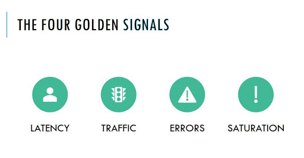

# Observability

## Observability 101: Introduction to Observability

1. Why do we need observability?

Software systems are becoming more complex with a growing amalgamation of microservices, containers, cloud, serverless etc. With many parts interacting, it can be difficult to pinpoint and understand the root causes of problems that occur.

One solution to help keep systems available and to deliver good customer experiences is observability.

2. What is observability?

Definition from Wikipedia:

    Observability is a measure of how well internal states of a system can be inferred from knowledge of its external outputs

For example, we may infer the status of a HTTP service, based on certain outputted response codes (i.e. 200, 500).

Further, as developers we can instrument systems to:

- gather actionable data
- provide context when understanding when and why an error occurred

3. What types of data does a service generate?

Data can be used as “sensors” to a service and to record state at a given time:

- Metrics: data plotted against time telling you “X happened N times” or “the response time of A is B”
- Logs: events, errors, or transaction records providing an audit trail or for deep debugging purposes provide detailed context around events
- Traces: tracking the path and latency that an individual transaction takes through a distributed architecture traces enable engineers to find bottlenecks

With system information on hand, system operators can:

- choose corrective actions to maintain stability of a given system
- understand the overall health of a system
- gauge the impact of any failures
- have a view of system performance over time

4. Tools

The observability team builds, maintains, and operates a range of tools for developers to use:

| Tool       | Summary                                                                             |
| ---------- | ----------------------------------------------------------------------------------- |
| SignalFx   | Analyze, visualize, automate and alert on metrics data                              |
| Splunk     | Searching and analyzing logs                                                        |
| LightStep  | Tracing, which helps pinpoint where failures occur and what causes poor performance |
| Sentry     | Error visibility, context and alerting                                              |
| Pollinator | Uptime measuring application that can detect outages on webapplications             |

Now that we’ve defined observability, and been through context around why it’s important, we’ll next look at answering the question: Which data points should we measure?

References:

[The Age of Observability](https://newrelic.com/resource/what-is-observability) by New Relic

[Achieving Observability](https://www.honeycomb.io/wp-content/uploads/2018/08/Honeycomb-Guide-Achieving-Observability-v1_1.pdf) by Honeycomb

[Observability in Your Production Systems: The Why and How](https://www.scalyr.com/blog/observability-production-systems-why-how/) by Scalyr

## Observability 102: What should I measure?

1. Introduction

Distributed systems can emit a multitude of granular metrics (host, database, infrastructure etc.). It would be highly impractical to continually monitor every single data point in detail.

Therefore it is suggested to pick a subset of these metrics that would serve as a system’s key performance indicators.

2. The Four ⭐️ Golden Signals

Google’s acclaimed [book](https://landing.google.com/sre/books/) on Site Reliability Engineering outlines 4 key attributes of a user-facing service that we should actively monitor, as they are essential in delivering a given service with high availability.

**Golden Signal #1: Latency**

We can define latency as:

    “the time that passes between an action and the resulting response”

Are users waiting a long time for an action to complete?

In the context of a service, it’s the time it takes to serve a request. It’s a good idea to track the latency of successful requests separately to that of failed requests.

As an example, HTTP 500 errors from your service triggered due to loss of connection to a database may be served very quickly. Grouping this together with successful requests may result in misleading latency figures overall - therefore, it’s better to track these figures separately.

**Golden Signal #2: Traffic**

This would measure the amount of load or volume of requests on a service.

In terms of a web service, this is typically the number of HTTP requests per second. In some cases, traffic may be measured by tracking network I/O, number of concurrent sessions, transactions or retrievals per second.

**Golden Signal #3: Errors**

The number of requests that fail, causing impact to users.

Examples include the number of HTTP 404’s or 500’s.

**Golden Signal #4: Utilisation or saturation**

How “full” or “busy” is the service?

There are many ways to measure this, depending on what constrains a particular service. For example a service may be restricted by memory, I/O, CPU etc. In many cases, latency increases are a leading indicator of saturation. Services may degrade in performance as they approach saturation.

3. Levels of metrics

We can emit metrics at 3 different layer of a given stack

| Layer       | What metric to measure                                                      | Why measure this?                                                                                                                                       | How would you measure?                                                                                       |
| ----------- | --------------------------------------------------------------------------- | ------------------------------------------------------------------------------------------------------------------------------------------------------- | ------------------------------------------------------------------------------------------------------------ |
| System      | Underlying resource usage: CPU, memory, disk                                | Provide context to your service through resource usage                                                                                                  | SignalFx Smart Agent sidecar on every Micros instance and/or SignalFx AWS integration for CloudWatch metrics |
| Application | Application internals such as queues, timings and flow                      | Provide insight into internal workings and assumptions of your service. e.g. How long do my DB calls take? Are my internal caches behaving as expected? | In code instrumentation such as StatsD, and within Micros :micros:to the StatsD platform sidecar             |
| Business    | Usage and core functionality of your service. e.g. MAU, Jira issues created | Is your service being used as you expected, or at all? Is that awesome new feature having the impact you thought?                                       | Javascript analytics, browser metrics, semantic monitoring, synthetic transactions                           |

Now that we’ve seen what types of metrics to collect, we will next look at creating alerts from these metrics.

References

[What is latency?](https://www.cloudflare.com/learning/performance/glossary/what-is-latency/) by Cloudfare

[Site Reliability Engineering](https://landing.google.com/sre/books/) by Google

[Monitoring SRE’s Golden Signals](https://www.infoq.com/articles/monitoring-SRE-golden-signals/) by InfoQ

[The Four Golden Signals for Monitoring Distributed Systems](https://blog.appoptics.com/the-four-golden-signals-for-monitoring-distributed-systems/) by SolarWinds

## Observability 103: Alerting, Symptoms vs. Causes

1. Introduction

Collecting metrics facilitate observability into a system.

Alerts (based off metrics) draws attention to a specific part of the system that requires human intervention or further analysis.

2. Alert?

Firstly, what is an alert?

    a notification intended to be read by a human and that is pushed to a system such as a bug or ticket queue, an email alias, or a pager

3. Symptoms vs. Causes alerting

Alerting on every single metric may result in a sea of noisy alarms.

Therefore it is important to differentiate between symptoms and underlying causes!

Symptoms based alerts let us know when user facing functionality is impacted. For example:

- a user cannot login
- a Confluence page cannot be created
- serving HTTP 500s or 404s
- responses are slow
- private content is now world-readable

Cause based alerts are the underlying causes, which may (or may not) end up impacting end user functionality. For example:

- high CPU on a server
- disk is full
- database servers are refusing connections
- new software push is causing ACLs (Access Control Lists) to be forgotten

Our guidance is to alert based on user impact i.e. symptoms, and not causes (within reason).

## Observability: Metrics Terminology

### Overview

We’ll be going through some terminology, naming conventions, and cardinality.

In our metrics pipeline diagram below, this page talks about part 1 where metrics are being emitted from a service.
