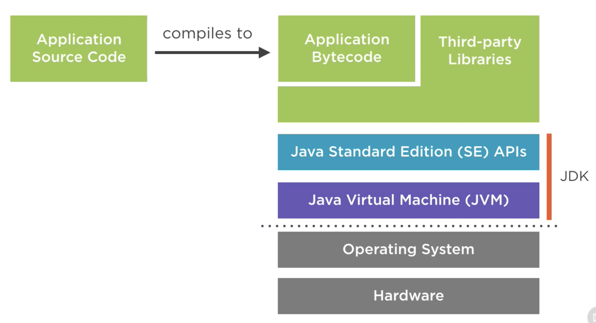
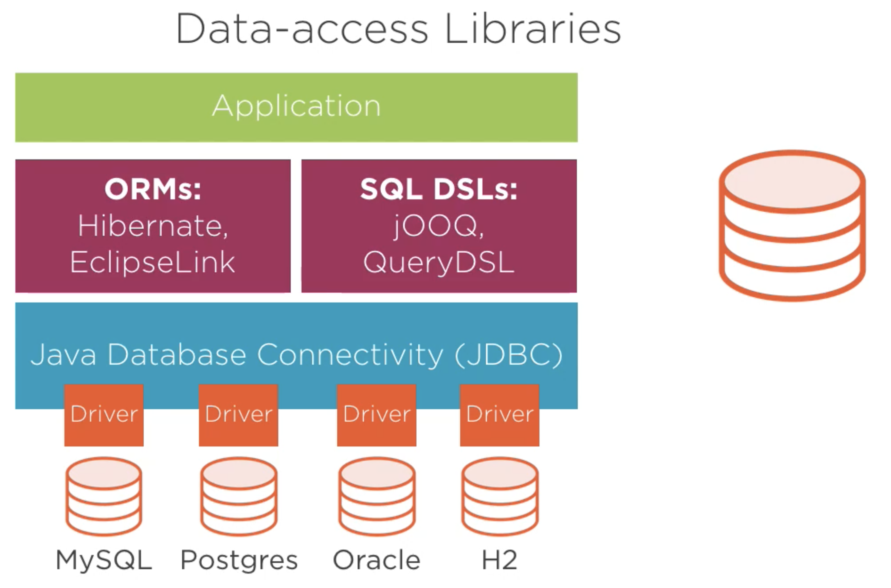

# Java: The Big Picture

Pluralsight course

Java 1.0 (1996)
This was the first public version of Java. It contained just 212 classes organized in eight packages. The Java platform has always had an emphasis on backward compatibility, and code written with Java 1.0 will still run today on Java 11 without modification or recompilation.

## Intro the Java Platform

Modern Java means the new (Cloud Agile DevOps)

Common misconceptions

1. It's not a coffee (there is a cup of coffe in the logo)
2. It's not the Island of Java In Indonesia (Jakarta)
3. It's not Javascript (No relation at all, the Javascript original name is ECMAScript, and Java belongs to Oracle)
4. It's not the [annoying Java plugin](https://www.google.com/url?sa=i&url=https%3A%2F%2Fwww.youtube.com%2Fwatch%3Fv%3DtOOg68GT_Wk&psig=AOvVaw1pYvO-s9m5vL6jLagFCfGb&ust=1617138290396000&source=images&cd=vfe&ved=0CAIQjRxqFwoTCJiz3-Kz1u8CFQAAAAAdAAAAABAJ) that everyone thinks you have to install to use flash in your computer and that had some security concerns.

**Defining Java Platfrom**
The Java Development Kit (JDK) comprends of 3 parts:

- Programming language
- Runtime enviroment (Java Virtual Machine - JVM)
- Standard library (Java Standard Edition SE APIs)

## Adpoting Java

**Philosophy**

- Portability: WORA (Write Once Runa Anywhere)
- Simplicity: Optimized for Redability
- Conservative: new features ('Firt do no harm', developer productivity, maintaining simplicity), backwards compatibility (controlled deprecation)
- Openness: Specification process, open-source ([openJDK](https://openjdk.java.net/), GPL 2 lincense), the java community.

**Choosing Java**

1. [Popularity](https://www.tiobe.com/tiobe-index/)
2. Scalable Development: Hierarchical and structured codebases, established coding practices, strong tooling and wealth of libraries
3. Productivity: [Type System](https://www.oreilly.com/library/view/java-in-a/9781449371296/ch04.html), Managed Runtime (automatic memory management, garbage collection, multi-threading)
4. Performance

## From Desktop to Entreprise Java to the Cloud

1. Desktop: single machine, interactive applications

   - [AWT](https://www.javatpoint.com/java-awt) (Abstract Windowing Toolkit)
   - [SWING](https://www.javatpoint.com/java-swing) (Pure Java GUI)
   - [JavaFX](https://www.javatpoint.com/javafx-tutorial) (Declarative UIs, 3D graphics) [OpenJFX](https://openjfx.io/)

2. Entreprise Java (Java EE)

Enterprise Edition (Java EE) is the standard in community-driven enterprise software

- Wildfly (Red Hat)
- WebSphere (IBM)
- WebLogic (Oracle)
- Tomcat (Apache)

Java EE 8 is the last Oracle release, now it moved to Eclipse Foundation [jakarta.ee/](https://jakarta.ee/).

[Spring](https://spring.io/) Framework: Spring makes programming Java quicker, easier, and safer for everybody. Spring’s focus on speed, simplicity, and productivity has made it the world's most popular Java framework.

3. Cloud

Microframeworks:

- [Spring Boot](https://spring.io/projects/spring-boot)
- [MicroProfile](https://microprofile.io/)
- [Vert.x](https://vertx.io/)
- [Play Framework](https://www.playframework.com/)

4. Android
   Java != Android Java

## Exploring Popular Java Libraries

1. [Spring Framework](https://spring.io/)

It's a framework wich governs the structure of your whole application.

You declare a component and their dependencies and Sprint brings them together at runtime in the Sprint depencency injection container.

- Dependency injection container
- Integration with data-access technologies
- Integration with Java EE technologies
- Spring webStack (WebFlux)

2. Other commonly Java Libraries

Utilities libraries:

- [Google Guava](https://guava.dev/) (additional collections, caching, IO helpers)
- [Apache Commons](https://commons.apache.org/) ([Collections](https://commons.apache.org/proper/commons-collections/), [CSV](https://commons.apache.org/proper/commons-csv/), [IO](https://commons.apache.org/proper/commons-io/), ...)
- [Apache Log4J](https://logging.apache.org/log4j/2.x/) (Structured application logging)

Distributed System Libraries:

- [Netty](https://netty.io/) ( High-performance networking)
- [Akka](https://akka.io/) (Actor model for concurrency, clustering and distribution)
- [RxJava](https://github.com/ReactiveX/RxJava) (Reactive programing)
- [Apache Camel](https://camel.apache.org/) (Entreprise application integration, many transports and connectors)

Data-access Libraries:

- ORMs: [Hibernate](https://hibernate.org/), [EclipseLink](https://www.eclipse.org/eclipselink/)
- SQL DSLs: [JOOQ](https://www.jooq.org/), [QueryDSL](http://www.querydsl.com/)

3. Java-based Data Processing

- [Apache Hadoop](https://hadoop.apache.org/)
- [Apache Spark](https://spark.apache.org/)
- [DL4J](https://deeplearning4j.org/): Deep Learning for Java
- [Cassandra](https://cassandra.apache.org/)
- [Neo4J](https://neo4j.com/)
- [ElasticSearch](https://www.elastic.co/)
- [HDFS](https://hadoop.apache.org/docs/r1.2.1/hdfs_design.html): Hadoop Distributed File System

## Practice and Common Tools

1. IDEs

Code completion (Intellisense), inline documentation, debugging, ...

- [Eclipse](https://www.eclipse.org/ide/)
- [IntelliJ](https://www.jetbrains.com/idea/)

2. Unit Testing

Write code to test code, Individual classes and methods, Isolate dependencies: mocking

- [JUnit](https://junit.org/junit5/)
- [Mockito](https://site.mockito.org/)

3. Build Tools

Repeatable builds, Managing multiple modules, Managing external dependencies, Running tests

- [Maven](https://maven.apache.org/)
- [Gradle](https://gradle.org/): Define builds with [Groovy](https://groovy-lang.org/) scripts, incremental builds, Maven default source layout, can use Maven Central.

4. Continues Integration and Quality Control

- [Jenkins](https://www.jenkins.io/): CI server

Static Code Analysis

- [Checkstyle](https://checkstyle.sourceforge.io/)
- [Spotbugs](https://spotbugs.github.io/)
- [PMD](https://pmd.github.io/)
- [SonarQube](https://www.sonarqube.org): Continues Inspection

## Examing Alternative Java Languages

Why Alternative JVM Language?

Productivity, familiarity, different paradigmas

- [Groovy](https://groovy-lang.org) (interpreted or compiled, opt-in type system, concise but still close to Java)
- [Scala](https://www.scala-lang.org/) (combines OO programing with functional programming, compiled language, extensive type system, Akka and Spark are written in Scala)
- [Kotlin](https://kotlinlang.org/) (A 'better Java', seamless Java interop, endorsed by Google for Android development, also runs in the browser)
