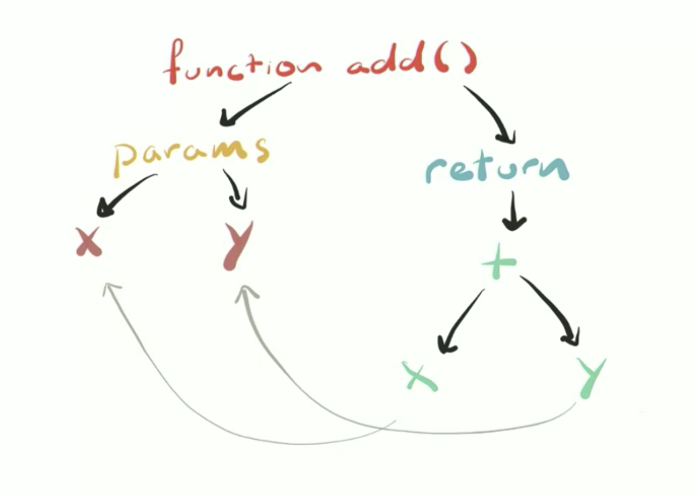

# Web Performance

Frontend Masters workshop with Steve Kinney [slides](https://speakerdeck.com/stevekinney/web-performance)

## What is performance and [why does it matter](https://web.dev/why-speed-matters/)?

    "The basic advice regarding response times has been about the same for thirty years [Miller 1968; Card et al. 1991]:

    0.1 second is about the limit for having the user feel that the system is reacting instantaneously, meaning that no special feedback is necessary except to display the result.

    1.0 second is about the limit for the user's flow of thought to stay uninterrupted, even though the user will notice the delay. Normally, no special feedback is necessary during delays of more than 0.1 but less than 1.0 second, but the user does lose the feeling of operating directly on the data.

    10 seconds is about the limit for keeping the user's attention focused on the dialogue. For longer delays, users will want to perform other tasks while waiting for the computer to finish, so they should be given feedback indicating when the computer expects to be done. Feedback during the delay is especially important if the response time is likely to be highly variable, since users will then not know what to expect."

From the article [Response Times: The 3 Important Limits](https://www.nngroup.com/articles/response-times-3-important-limits/)

[The Need for Speed, 23 Years Later](https://www.nngroup.com/articles/the-need-for-speed/)

## Think about performance

Three different ways of thinking about performance: network load performance, JavaScript performance and rendering performance.

[RAIL](https://web.dev/rail/) is a user-centric performance model that provides a structure for thinking about performance. The model breaks down the user's experience into key actions (for example, tap, scroll, load) and helps you define performance goals for each of them.

## The importance of measurement

Before beginning to improve performance, you need to determine whether or not there is a performance problem: Golden Rules of web performance.

"Measure. Don't tune for speed until you've measured, and even then don't unless one part of the code overwhelms the rest." - Rob Pike

Premature optimization: do not go just blindly applying performances optimizations, there is a cost to every abstraction and everything has a trade off. Performance is one of those things where if we're not keeping an eye on it, it has a chance ig getting away from us.
Some things to think about while measuring

- Are we testign performance on a fancy MacBook Pros or a consumer-grade hardware?
- Are we simulating less-than-perfect network conditions?
- What is our performance budget?

Thinking deeply about the architecture and design of your application is a better use of your time then micro-benchmarks.

Three Tiers of Advice:

1. Definitely do this
2. Maybe do this, but measure before and after
3. Only do this if you find a performance problem that needs solving.

Steve's Golden Rules of web performance:

1. Doing less stuff takes les time
2. If you can do it later, do it later

Outline:

- [JavaScript performance](#javaScript-performance): Write code that runs faster, later, or not at all.
- [Rendering performance](#Rendering-perfromence): It turns out most of our JavaScript happens in the broswer, which has its own performance concerns.
- [Load performance](#Load-performance): Until the user actually gets rthe page, there isn't much to optimize.

### JavaScript performance

A lot of performance advice recommends that we compress our assets and worry about download times. How to measure our applications to determine where most of the startup time is spent?
JavaScript is a compiled language and most browser uses [just-in-time (JIT) compilation](https://www.freecodecamp.org/news/just-in-time-compilation-explained/)

Things to know about JIT compilation

- It means that there is a compilation step.
- It means that it happens moments before execution.
- That means it happens on our client's machine.
- That means they're paying thge cost and/or doing the hard work for us.


A lot of time and energy is spent in compressinf asstes, removing requests and reducing latency, but what about one the applicatiuon is running? Sometimes, parsing and compilind is the real culprit

**Parsing**

The source code is ther true intentiuon of the application, but the engine needs to figure out what this means.

Parsing can be slow, as slow as **1MB/s on mobile** and one way to reduce parsing time is to have less code to parse. Another way is todo as much parsing as you need and as little as you can get away with.

Parsing happens in 2 phases

1. **Eager** (full parse): This is what you think of when you think about parsing.
2. **Lazy** (pre-parsing): Do the bear minimum now, we'll parse the rest later.
   The basic rules is to scan through the top-level scope. Parse all the code you see that's actually doing something. Then, parse the rest later.

```js
// These will be eagerly-parsed
const a = 1;
const b = 2;

// Take note that there a function here
// but, we'll parse the body when we need it.
function add (a, b) {
    retrun  x + y;
}
add (a, b); // Whoa. Go back and parse add()!
```

**Corollary:** Doing styff twice is slower than doing it once

```js
const a = 1;
const b = 2;

// Parse it now!
(function add (a, b) {
    retrun  x + y;
});
add (a, b);
```

[optimize-js](https://github.com/nolanlawson/optimize-js)Optimize a JavaScript file for faster initial execution and parsing, by wrapping all immediately-invoked functions or likely-to-be-invoked functions in parentheses.

[Test optimize-js](https://nolanlawson.github.io/test-optimize-js/)

Try to avoind nested functions

```js
function sumOfSquares(x, y) {
  // This function will repeatedly be parsed.
  function square(n) {
    return n * n;
  }
  return square(n) + square(y);
}
```

Better option:

```js
function square(n) {
  return n * n;
}
function sumOfSquares(x, y) {
  return square(n) + square(y);
}
```

**AST (abstract syntax tree)**

Once the code has been parsed, an abstract syntax tree is created. The AST is a representation of our code that can be turned into byte code by the baseline compiler. Essential, we've gone from a big long string of text to an actual data structure representing our code.



**The Optimizing Compiler**

The 3 things that the engine does to help us out is [Speculative optimization](https://ponyfoo.com/articles/an-introduction-to-speculative-optimization-in-v8), hidden classes for dynamic lookups, function inlining.

[JavaScript Performance Course Exercises](https://github.com/stevekinney/web-performance)

`$node --trace-opt --trace-deopt`

`$node --allow-natives-syntax`

Example

```js
function add(x, y) {
  return x + y;
}

add(1, 2); // Optimize the function with params as numbers
%OptimizeFunctionOnNextCall(add); // Native Syntax
add(3, "4"); // Deoptimize the fucntion as params have a string now.
```

**Speculative optimization**

- We use an interpreter because the optimizing compiler is slow to get started.
- Also it need some information before it knows what work it can either optimize or skip out on all together.
- So the interpreter start gathering feedback about what it sees as the function is used.

The optimizing compiler optimizes for what it's seen. If it sees something new, that's problematic.If you just have number, it optimize for number, but if some strings are introduced it deoptimize.

There is potential performance gains when using any type of static type checker for JavaScript like Flow or Typescript. This will make sure you are always passing the same type to the function.

JavaScript is a dynamic language, but JavaScript keeps track of types under the hood. Functions can be optimized for the types of object's they've seen in the past. There is a few types of **\*-morphism**:

- **Monomorphism:** This is all I know and all that I've sen. I can get incredibly fast at this one thing
- **Polymorphism**: I've seen a few shapes before. LEt me just check to see which one and then I'll go do the fast thing.
- **Megamorphism**: I've seen things. A lot of things. I'm not particularly specialized. Sorry.

**Hidden classes in V8**

It turns out there is a secret system behing your back, the [hidden classes in V8](https://stackoverflow.com/questions/47580935/v8-hidden-classes-for-two-objects-of-the-same-type-are-not-the-same-if-property.

Compare objects created in different ways to see if they have the same hidden class:

`$node --allow-natives-syntax`

```js
const a = { a: 1 };
const b = { a: 1 };

console.log(%HaveSameMap(a, b)); //true

a.x = 456;
console.log(%HaveSameMap(a, b)); //false

b.x = 100;
console.log(%HaveSameMap(a, b)); //true
```

```js
const a = { a: 1 };
const b = Object.assign({}, a);
const c = Object.assign({}, a);

console.log(%HaveSameMap(a, b)); //false (because it was created differently using Object.assign)
console.log(%HaveSameMap(b, c)); //true
```

```js
class Point {
  constructor(x, y) {
    this.x = x;
    this.y = y;
  }
}

const a = new Point(1, 2);
const b = new Point(3, 4);

console.log(%HaveSameMap(a, b)); //true
```

**Dinamic lookup**: This object could be anything, so let me look at the rule book and figure this out.

Some takeaway

- Turbofan is able to optimize your code in substantial ways if you pass it consistent values.
- Initialize your properties at creation
- Initialize them in the smae order
- Try not to modify them after the fact
- Maybe just use TypeScript or Flow so you don't have to worry about these things!

**Function inline**

### Rendering performance

### Load performance
